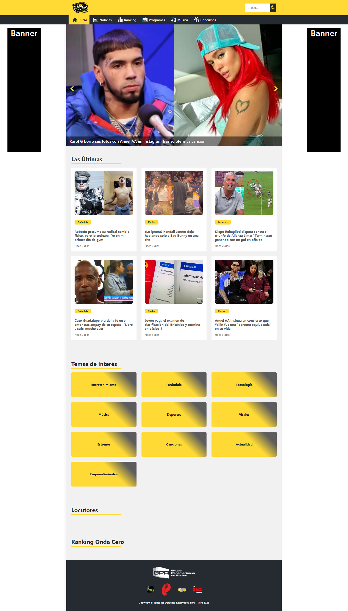
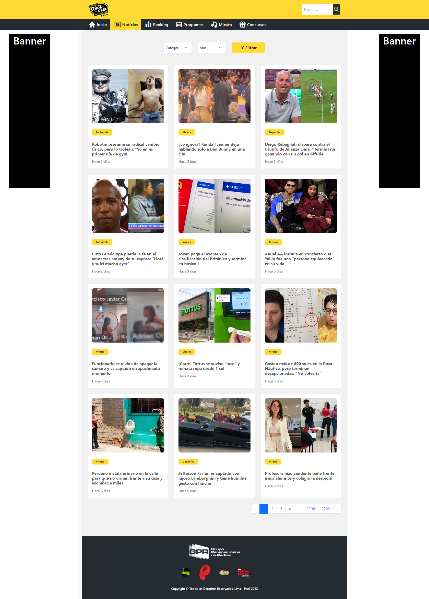
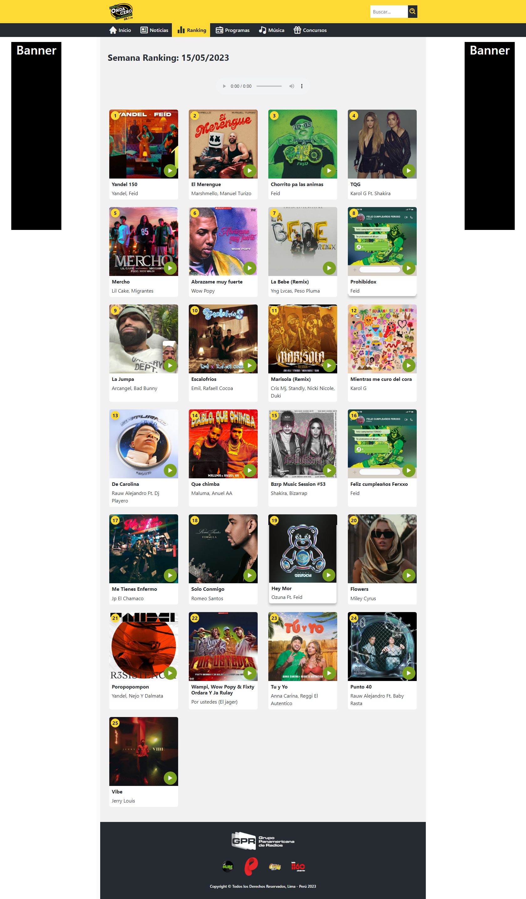
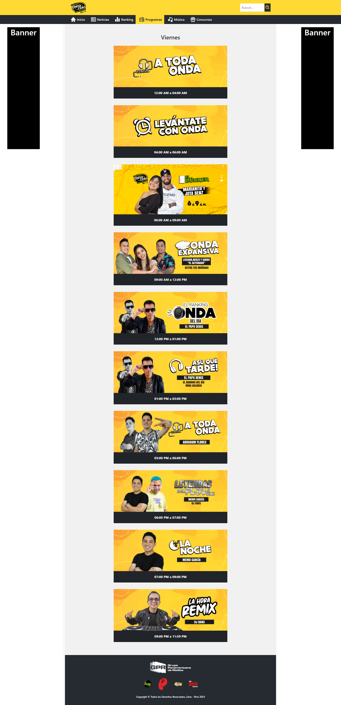

## **Radio Onda Cero**

> Radio Onda Cero es una emisora de radio peruana que opera a nivel nacional. Es una de las estaciones de radio más populares y reconocidas en el país. La emisora transmite una variedad de programas de entretenimiento, música, noticias y deportes. Radio Onda Cero se caracteriza por su programación diversa y su enfoque en brindar información actualizada y entretenimiento de calidad a su audiencia.

### **Problemática**

> Actualmente Radio Onda Cero tiene como principal fuente de ingresos los anuncios (publicidades) por redes sociales y la web site, siendo esta última la que menos vistas esta generando entre las diversas causas se encuentran

- Diseño no responsivo 
- Estructura del sitio mal definida
- Framework obsoleto, desactualizado e inseguro - codeigniter 3 

> Por lo tanto, mediante esta propuesta de mejoras se busca poder aumentar las vistas y mejorar la interacción de los usuarios con la website de Radio Onda Cero, para estas mejoras se esta utilizando lo siguiente:

- Laravel 8 - Backend / SSR
- Vercel - Server
- Vanilla JS
- CSS & Boostrap 5.2

### **Views**

### *Resources*

- [Deploy laravel with css and js files](https://imagdic.me/blog/deploying-laravel-application-to-vercel/)
